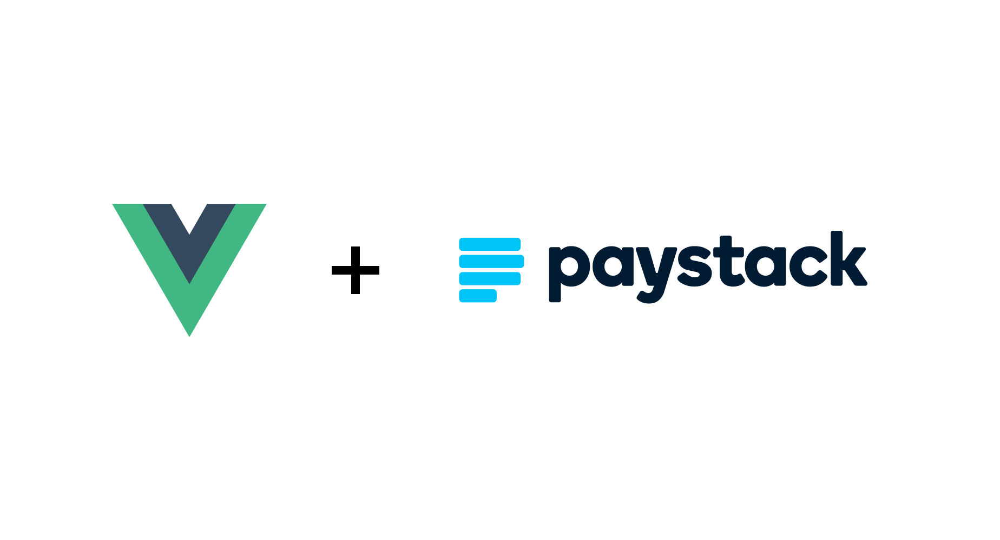

<p align="center">

<br>
<p align="center">
<b>Vue-Paystack2</b> is a Paystack payment gateway integration for Vue which <br> provides <b>Universal support</b> for Vue 2 & 3<br>
</p>

## Table of Contents

- [✨ &nbsp;Install](#install)
- [✨ &nbsp;Usage](#usage)
- [📖 &nbsp;License](#license)

## Install

Install this as your plugin's dependency:

```bash
npm i vue-paystack2
# or
yarn add vue-paystack2
```

If you are using Vue2 you would need to install Vue's Composition API:

```bash
npm i @vue/composition-api
# or
yarn add @vue/composition-api
```

## Usage

```bash
<template>
    <VuePaystack :paystack-key="paystackKey" :firstname="firstname" :lastname="lastname" :email="email" :amount="amount"  :reference="reference" :callback="onSuccess" :close="onClose">
      Button
    </VuePaystack>
</template>

<script>
import VuePaystack from "vue-paystack2"

export default {
  name: 'App',
  components: {
    VuePaystack
  },
  data () {
    return {
      paystackKey: '...',
      email: '...',
      firstname: '...',
      lastname: '...',
      amount: 0,
      reference: '...'
    }
  },
  methods: {
    onSuccess (event) {
      // ...
    },
    onClose () {
      // ...
    }
  }
}
</script>
```

## License

Inspired by [vue-paystack](https://github.com/iamraphson/vue-paystack)

MIT License © 2021 [Enoch Chejieh](https://github.com/ECJ222)
